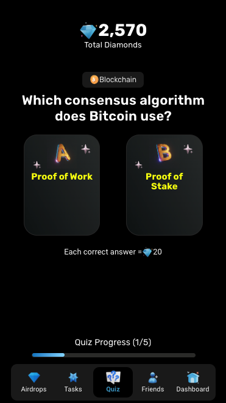
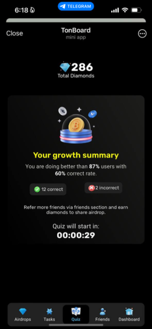

# TonBoard - Telegram Onboarding makes simple

**TonBoard** is a Telegram mini-app designed to engage users in crypto quizzes, leaderboard competitions, and reward them with airdrops. It leverages the power of the Telegram ecosystem to provide an intuitive and gamified experience for crypto enthusiasts.

|  |  |
| ----------------------------------- | ---------------------------------- |

## 🌟 Features

- **Crypto Quizzes**: Test your crypto knowledge and earn points.
- **Tasks and Challenges**: Complete tasks to earn rewards and diamonds.
- **Leaderboards**: Compete with friends and other users to climb the leaderboard.
- **Airdrops**: Earn exclusive airdrops based on your performance and engagement.
- **Referral System**: Invite friends to participate and boost your rewards.

## 🚀 How It Works

1. **Join Quizzes**: Participate in periodic crypto quizzes to earn diamonds.
2. **Complete Tasks**: Finish various tasks and activities provided in the mini-app.
3. **Compete in Leaderboards**: Track your progress and compare with others on the leaderboard.
4. **Earn Airdrops**: Use diamonds to claim exclusive rewards and airdrops.

## 🔗 Getting Started

TonBoard is accessible as a **Telegram Mini App**. Open it directly from Telegram:

1. Search for **TonBoard** in Telegram or click the provided link.
2. Log in and start engaging with tasks, quizzes, and leaderboards.

## 🛠️ Tech Stack

- **Frontend**: Built with modern web technologies optimized for the Telegram Mini App ecosystem.
- **Backend**: Secure API to handle user data, quiz logic, and leaderboard updates.
- **Blockchain**: Integrated with **The Open Network (TON)** for airdrop rewards.

## 🌐 Live Demo

**Access the Telegram Mini App:** [TonBoard](https://t.me/tonboardapp_bot)

## 🤝 Contribution

We welcome contributions to make TonBoard even better. To contribute:

1. Fork the repository.
2. Create a feature branch.
3. Make your changes and submit a pull request.

## 📝 License

This project is licensed under the MIT License. See the [LICENSE](LICENSE) file for details.

## 📧 Contact

For any queries or collaborations, feel free to reach out:

- Telegram: [TonBoard](https://t.me/tahirahmadin)
- GitHub Repository: [TonBoard on GitHub](https://github.com/tahirahmadin/TonBoard)
